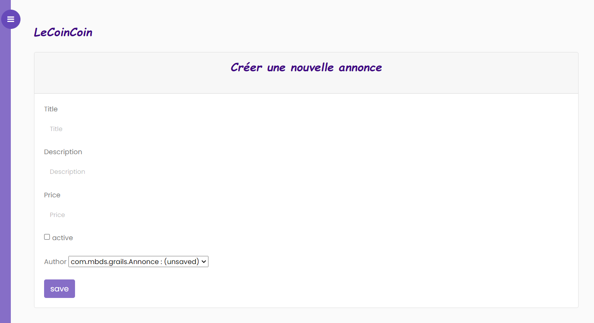

<h1 style="color: red;text-align: center" >Compte rendu du projet LeCoinCoin</h1>
 
<h3 style="text-align: center;">Réaliser par : EL MTOUGUI Hanane   ALLAM  Aouatif</h3>
 
  <h4>Problématique</h4>

LeCoinCoin projet a comme objectif la vente de tous ce qui qui se peut vendre
ou s'acheter,mais il a raté le tournant du numérique ,pour cela notre projet vient 
répondre à cette problématique

<h1>Besoins fonctionnels:</h1>

Authentification, lister les annonces, créer les comptes utilisateurs, ajouter, modifier, supprimer annonce.

<h3>*S'identifier/se déconnecter</h3>
<h3>*Les comptes utilisateurs pourront avoir 3 roles : ADMIN,MODERATEUR,CLIENT</h3>
<h3>*Le MODERATEUR et L'ADMIN pouront tout les deux accéder au Backend</h3>
<h3>*Les opérations de CRUD concernent : </h3>
<h3>Les annonces, Les Users ,Les Illustrations</h3>
<h1>Besoins non fonctionnels :</h1>

le design de la plateforme

 
 
<h1>Solution</h1>

Dans notre solution on s'est réaliser une application web avec un Backend qui permer à 
Mr LeCoinCoin d'administrer les annonces,les modifiers,les supprimer et meme en créer , on a utilisé comme langage de programmation le langage GROOVY avec son framework Grails de version 3.3.8

<h4>Dépendence utilisées : Spring Security</h4>
<h2>Lien vers Démonstration : https://www.youtube.com/watch?v=g-7lMDZdZvA</h2>

 
<h3 style="color: #2f6f9f">SideBar et contenu de la page</h3>

apres l'éxécution du projet

<h6 style="text-align: center"><strong>Figure1: SideBar et contenu de la page</strong></h6>
<h3 style="color: #2f6f9f">Login</h3>

Pour qu'un utilisateur Admin puisse consulter la liste des autres utilisateurs
il doit s'authentifier

<h6 style="text-align: center"><strong>Figure2: Login user </strong></h6>
 
<h3 style="color: #2f6f9f">Affichage des annonces</h3>

<h6 style="text-align: center"><strong>Figure3: liste d'annonce</strong></h6>

La figure 3 montre l'ensemble des annonces avec leurs illustrations,ou l'admin peut
accéder à la liste des utilisateurs après son authentification.
Ainsi il peut visualiser le title ,les illustrations et l'author,on réalisant en 
meme temps les applications de modifications et suppression

<h6 style="text-align: center"><strong>Figure4: visualisation des détails
de l'annonce</strong></h6>

La figure ci dessous montre la possibilité de modifier les informations
de l'annonce 

<h6 style="text-align: center"><strong>Figure5: modification de l'annonce</strong></h6>
 

On peut meme visualiser les détails de l'author ainsi que 
modifier les informations et la possibilité de suppression
comme montrer dans la figure6

<h6 style="text-align: center"><strong>Figure6: Details de l'author</strong></h6>
 

La figure 7 montre  l'affichage des détails de chaque illustration qui s'affecte à chaque
annonce avec la possibilité de modifier et de supprimer 

<h6 style="text-align: center"><strong>Figure7: Details de chaque illustration</strong></h6>

le bouton lien vers l'annonce permet la redirection vers le détails de l'annonce 
comme montrer dans la figure 4

 

La figure 8 montre la possibilité d'ajouter une nouvelle Annonce

<h6 style="text-align: center"><strong>Figure8: Création d'une nouvelle Annonce</strong></h6>
 
 
<h3 style="color: #2f6f9f">Liste des illustrations</h3>

l'utilisateur peut aussi afficher l'ensemble des illustrations avec les filename et 
les annonces

<h6 style="text-align: center"><strong>Figure9: Liste des illustrations</strong></h6>
 

On peut meme consulter chaque filename qui ne redirige vers le détails de l'illustration
comme dans la figure 7 avec la possibilté de la mmodifier et la supprimer

 

Ainsi on peut consulter chaque annonce qui nous redirige vers le détails de l'annonce comme dans
la figure4 avec la possibilité de la modifier et la supprimer

 

La figure 10 montre la possibilité de créer une nouvelle illustration

<h6 style="text-align: center"><strong>Figure10: Création d'une nouvelle Illustration</strong></h6>
 
 
<h3 style="color: #2f6f9f">Users</h3>

Affichage des liste des utilisateurs

<h6 style="text-align: center"><strong>Figure11: Liste des utilisateurs</strong></h6>
 

l'admin a la possibilité d'ajouter un nouveau utilisateur

<h6 style="text-align: center"><strong>Figure12: Ajout d'un user</strong></h6>
